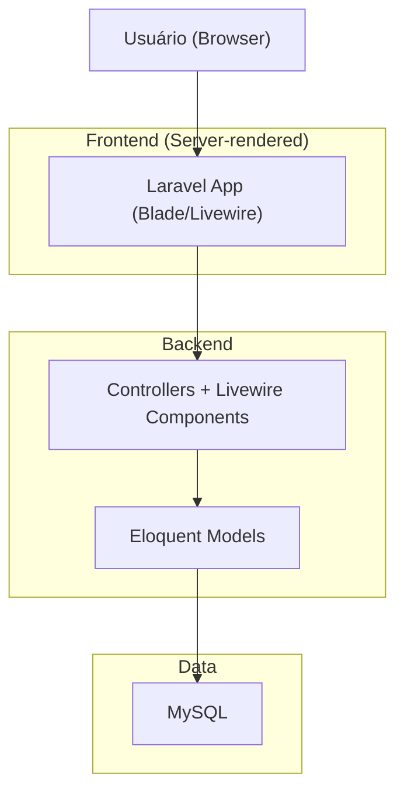
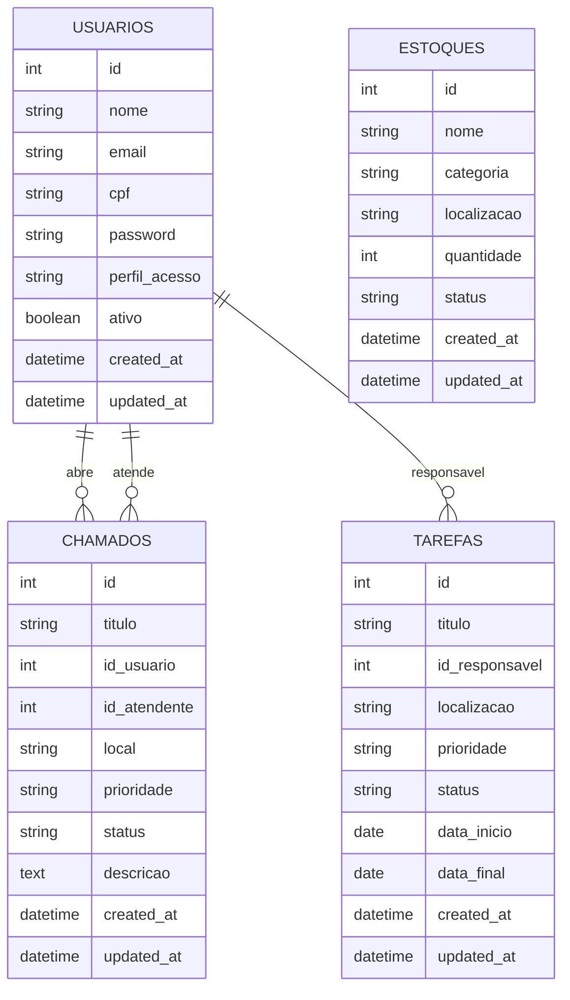

## 1.Architecture design


## 2.Technology Description
- Backend/Fullstack: PHP@8.2 + Laravel@11
- UI: Blade + TailwindCSS + (Livewire onde aplicável) + Alpine.js
- Banco: MySQL
- Build: Vite
- Auth: Laravel (Breeze/Fortify conforme scaffolding do projeto)

## 3.Route definitions
| Route | Purpose |
|---|---|
| / | Home/entrada (welcome) |
| /login | Login |
| /register | Cadastro |
| /dashboard | Dashboard (autenticado) |
| /chamados | CRUD de chamados |
| /tarefas | CRUD de tarefas |
| /estoques | CRUD de estoque |
| /usuarios | CRUD de usuários |
| /relatorios | Relatórios (conforme telas; pode iniciar como view estática) |

## 6.Data model(if applicable)
### 6.1 Data model definition


### 6.2 Data Definition Language
**Observação:** a DDL abaixo é um resumo dos migrations atuais (tabelas: `usuarios`, `chamados`, `tarefas`, `estoques`).

```sql
CREATE TABLE usuarios (
  id BIGINT PRIMARY KEY AUTO_INCREMENT,
  nome VARCHAR(255) NOT NULL,
  email VARCHAR(255) NOT NULL UNIQUE,
  cpf VARCHAR(255) NOT NULL UNIQUE,
  password VARCHAR(255) NOT NULL,
  perfil_acesso ENUM('cliente','admin','atendente','gerente','manutencao','financeiro') DEFAULT 'cliente',
  ativo TINYINT(1) DEFAULT 1,
  created_at TIMESTAMP NULL,
  updated_at TIMESTAMP NULL
);

CREATE TABLE chamados (
  id BIGINT PRIMARY KEY AUTO_INCREMENT,
  titulo VARCHAR(255) NOT NULL,
  id_usuario BIGINT NOT NULL,
  id_atendente BIGINT NULL,
  local VARCHAR(255) NOT NULL,
  prioridade ENUM('Baixa','Média','Alta','Urgente') DEFAULT 'Média',
  status ENUM('Aberto','Em Análise','Fechado') DEFAULT 'Aberto',
  descricao TEXT NULL,
  created_at TIMESTAMP NULL,
  updated_at TIMESTAMP NULL
);

CREATE TABLE tarefas (
  id BIGINT PRIMARY KEY AUTO_INCREMENT,
  titulo VARCHAR(255) NOT NULL,
  id_responsavel BIGINT NOT NULL,
  localizacao VARCHAR(255) NOT NULL,
  prioridade ENUM('Baixa','Média','Alta','Urgente') DEFAULT 'Média',
  status ENUM('Pendente','Em Andamento','Concluído') DEFAULT 'Pendente',
  data_inicio DATE NOT NULL,
  data_final DATE NOT NULL,
  created_at TIMESTAMP NULL,
  updated_at TIMESTAMP NULL
);

CREATE TABLE estoques (
  id BIGINT PRIMARY KEY AUTO_INCREMENT,
  nome VARCHAR(255) NOT NULL,
  categoria VARCHAR(255) NOT NULL,
  localizacao VARCHAR(255) NOT NULL,
  quantidade INT DEFAULT 0,
  status ENUM('Disponível','Estoque Baixo','Esgotado') DEFAULT 'Disponível',
  created_at TIMESTAMP NULL,
  updated_at TIMESTAMP NULL
);
```