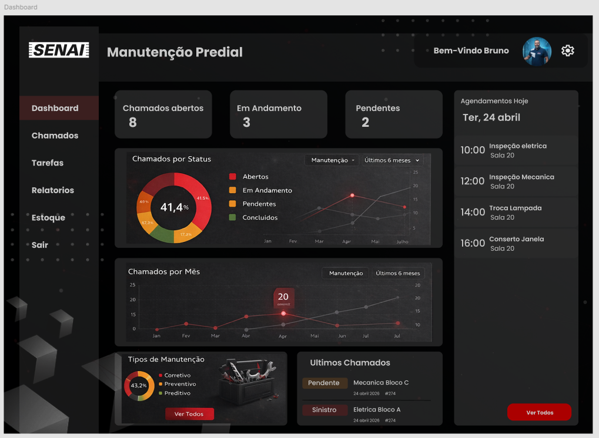
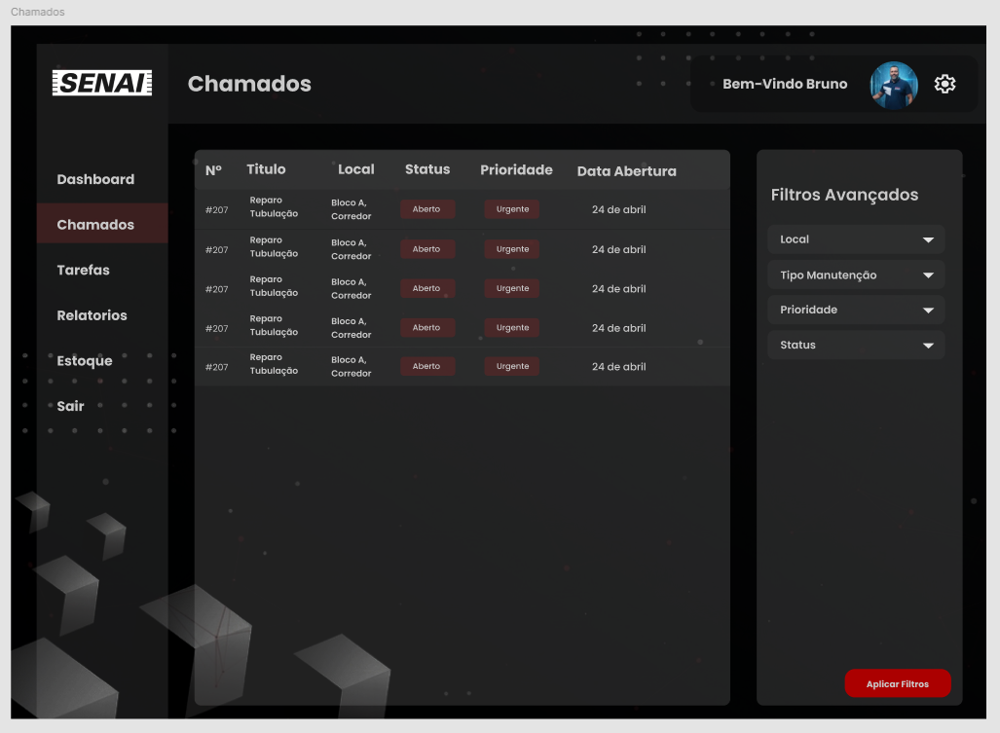
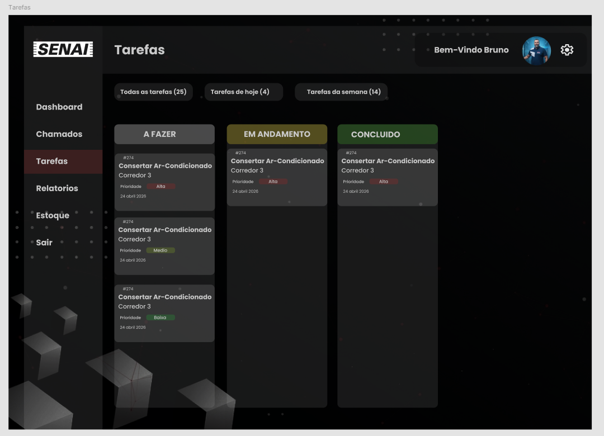
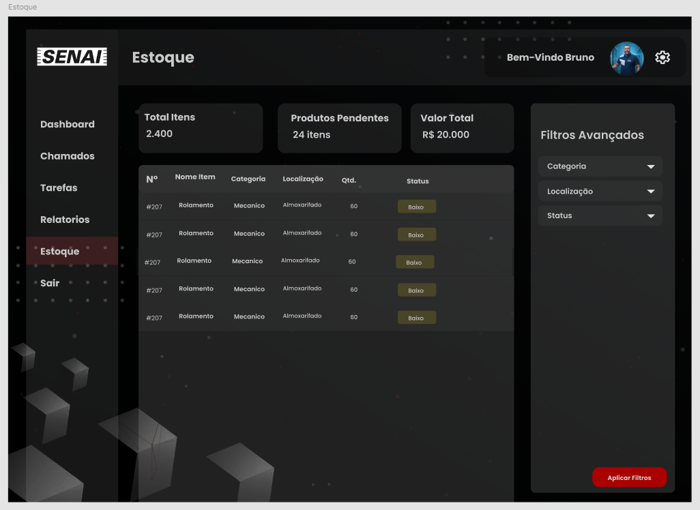
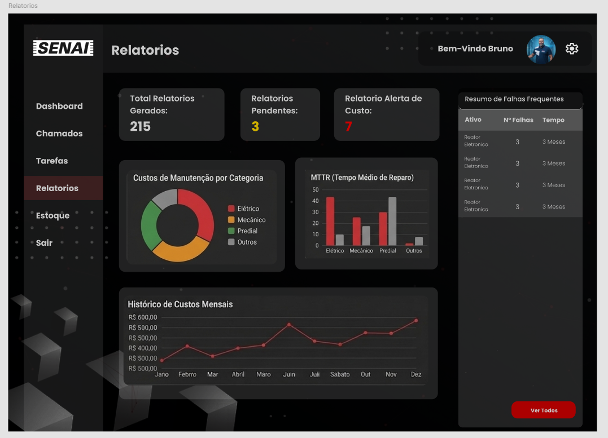

# Page Design — PredialFix (desktop-first, responsivo)

## Global Styles (tokens)
- Cores (base PRD): primária **#fc9432**, secundária **#00c2a8**, destaque **#fcce14**, info **#e08fff**, neutros: **#ffffff**, **#1a1a2e**, cinzas.
- Tipografia: headings (ex. Poppins) + body (ex. Inter) conforme PRD/figma.
- Botões: primário (filled), secundário (outline), perigo (vermelho).
- Links: sublinhar apenas em hover; foco visível em todos os controles.

## Layout (sistema)
- Desktop-first: grid com **sidebar fixa** (largura 260–300px) + **topbar** + conteúdo.
- Breakpoints sugeridos: >=1024px (desktop), 768–1023px (tablet), <768px (mobile).
- Responsivo: sidebar colapsa em drawer no mobile; tabelas com `overflow-x`.

## Meta Information (padrão)
- Title: "PredialFix | {Página}"; Description: descrição curta por página.
- Open Graph básico: `og:title`, `og:description`, `og:type=website`.

---

## 1) Home (Entrada)
Referência: 
- Estrutura: hero simples + CTA para entrar/cadastrar.
- Componentes: `HeaderGuest`, `CTAButton`, `Footer`.

## 2) Login e Cadastro
Referência: 
- Layout: card central (desktop) + background; no mobile, card full-width com padding.
- Seções: logo; tabs (Login/Cadastro) ou páginas separadas; formulário; links (esqueci senha).
- Componentes: `AuthCard`, `TextInput`, `PasswordInput`, `ButtonPrimary`, `InlineError`, `AuthFooterLinks`.

## 3) Dashboard
Referência: 
- Estrutura: AppShell → topo com título + filtros (se houver) → grid de cards KPI → lista/atalhos.
- Componentes: `CardStat` (4–6), `QuickActions`, `RecentList` (ex.: últimos chamados/tarefas).
- Responsivo: cards em 3–4 colunas (desktop), 2 (tablet), 1 (mobile).

## 4) Chamados
Referência: 
- Estrutura: AppShell → toolbar (buscar + filtros + botão Novo) → DataTable → modal/criar/editar.
- Colunas típicas: título, local, prioridade (badge), status (badge), solicitante/atendente, ações.
- Componentes: `DataTable`, `FilterBar`, `Badge`, `Modal(ChamadoForm)`, `ConfirmDialog`.

## 5) Tarefas
Referência: 
- Estrutura: semelhante a Chamados (lista + filtros + criar/editar).
- Campos visuais: datas (início/final) em destaque; status com badge.
- Componentes: `DateInput`, `StatusBadge`, `Modal(TarefaForm)`.

## 6) Estoque
Referência: 
- Estrutura: tabela com quantidade e status de estoque; ações rápidas (editar/ajustar quantidade).
- Componentes: `QuantityPill` (opcional), `Badge` para status, `Modal(EstoqueForm)`.

## 7) Usuários
Referência (layout segue padrão AppShell): gestão em tabela + modal.
- Componentes: `DataTable`, `UserBadge(perfil_acesso)`, `ToggleAtivo`, `Modal(UsuarioForm)`.

## 8) Relatórios
Referência: 
- Estrutura: cards de indicadores + seções com gráficos/tabelas (somente o que existir na tela).
- Componentes: `CardStat`, `ReportSection`, `ChartContainer` (se aplicável).
- Responsivo: gráficos empilham; tabelas com scroll horizontal.
