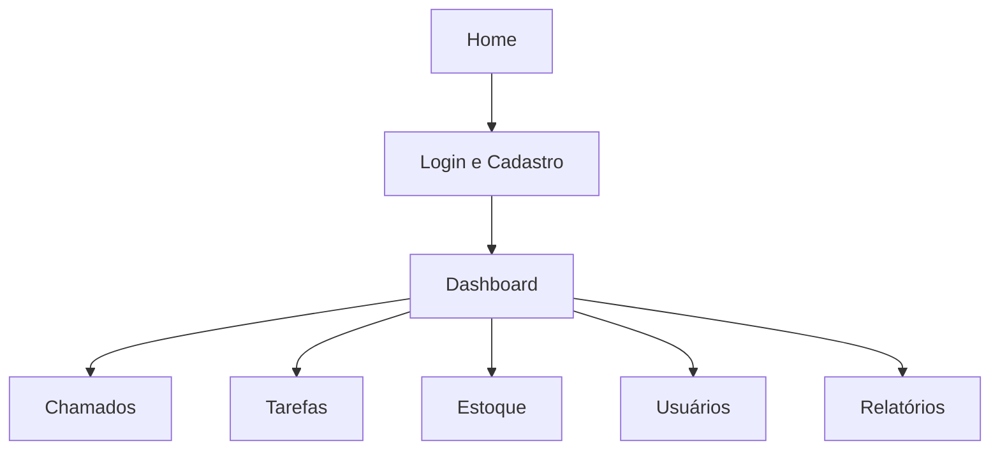

## 1. Product Overview
PredialFix é uma plataforma web para gestão de manutenção predial (unidades SENAI), centralizando chamados, tarefas e controle operacional.
O foco é reduzir tempo de resposta e dar visibilidade do status para todos os perfis.

## 2. Core Features

### 2.1 User Roles
| Papel (perfil_acesso) | Método de registro | Permissões principais |
|---|---|---|
| cliente | Cadastro/Login (e-mail + CPF) | Acessar dashboard; abrir/acompanhar chamados; visualizar tarefas atribuídas (se aplicável). |
| atendente | Criado por admin/gerente | Atender chamados; atualizar status; atuar em tarefas. |
| manutencao | Criado por admin/gerente | Executar tarefas; apoiar atendimento de chamados. |
| gerente | Criado por admin | Visão da operação; gerenciar chamados/tarefas/estoque; relatórios. |
| financeiro | Criado por admin | Acesso a relatórios/indicadores (quando aplicável). |
| admin | Criado por admin | Acesso total (usuários, permissões, CRUDs). |

### 2.2 Feature Module
1. **Home (Landing/Entrada)**: apresentação do sistema + CTA para login/cadastro.
2. **Login e Cadastro**: autenticar usuário e criar conta.
3. **Dashboard**: visão geral (cards/indicadores) e atalhos para módulos.
4. **Chamados**: listar, criar e acompanhar chamados; atualizar status/prioridade.
5. **Tarefas**: listar e gerenciar tarefas com datas e status.
6. **Estoque**: listar e gerenciar itens, quantidade e status de estoque.
7. **Usuários**: listar e gerenciar usuários do sistema e perfil de acesso.
8. **Relatórios**: visualizar relatórios/indicadores (conforme telas anexadas).

### 2.3 Page Details
| Page Name | Module Name | Feature description |
|---|---|---|
| Home (Landing/Entrada) | CTA de acesso | Direcionar para login/cadastro e entrada do sistema. |
| Login e Cadastro | Formulários | Autenticar; cadastrar com validações; exibir mensagens de erro/sucesso. |
| Dashboard | Resumo e navegação | Exibir cards de resumo; exibir lista/atalhos para Chamados/Tarefas/Estoque/Relatórios. |
| Chamados | CRUD + status | Listar/filtrar; criar; editar; atribuir atendente; alterar prioridade e status; visualizar detalhes. |
| Tarefas | CRUD + prazos | Listar/filtrar; criar; editar; atribuir responsável; controlar datas (início/final) e status. |
| Estoque | CRUD + controle de quantidade | Listar/filtrar; criar; editar; atualizar quantidade; refletir status (Disponível/Estoque Baixo/Esgotado). |
| Usuários | CRUD + perfis | Listar/filtrar; criar/editar; ativar/desativar; definir perfil de acesso. |
| Relatórios | Visualização | Exibir relatórios e indicadores do sistema em layout próprio. |

## 3. Core Process
**Fluxo (usuário/cliente):** acessar Home → login/cadastro → Dashboard → abrir/acompanhar Chamados e visualizar Tarefas/Relatórios disponíveis.
**Fluxo (atendente/manutenção):** login → Dashboard → acessar Chamados/Tarefas atribuídos → atualizar status conforme execução.
**Fluxo (gerente/admin):** login → Dashboard → gerenciar Usuários/Chamados/Tarefas/Estoque → acompanhar Relatórios.

